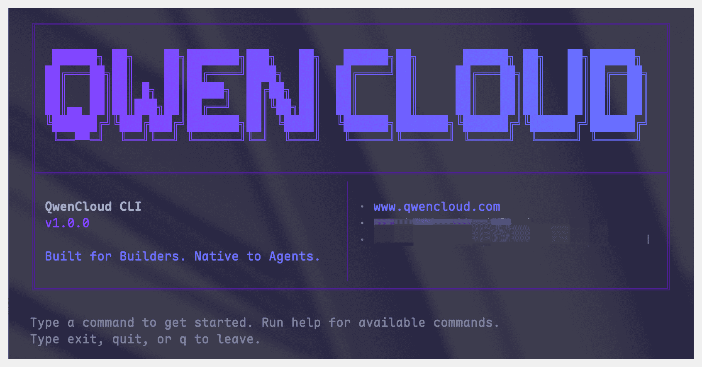
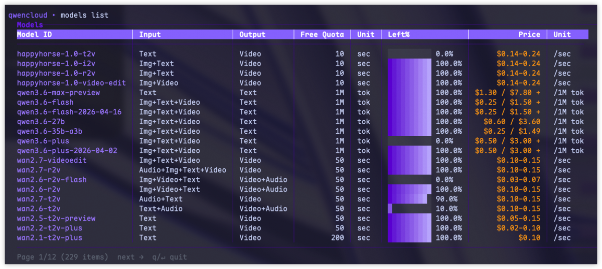
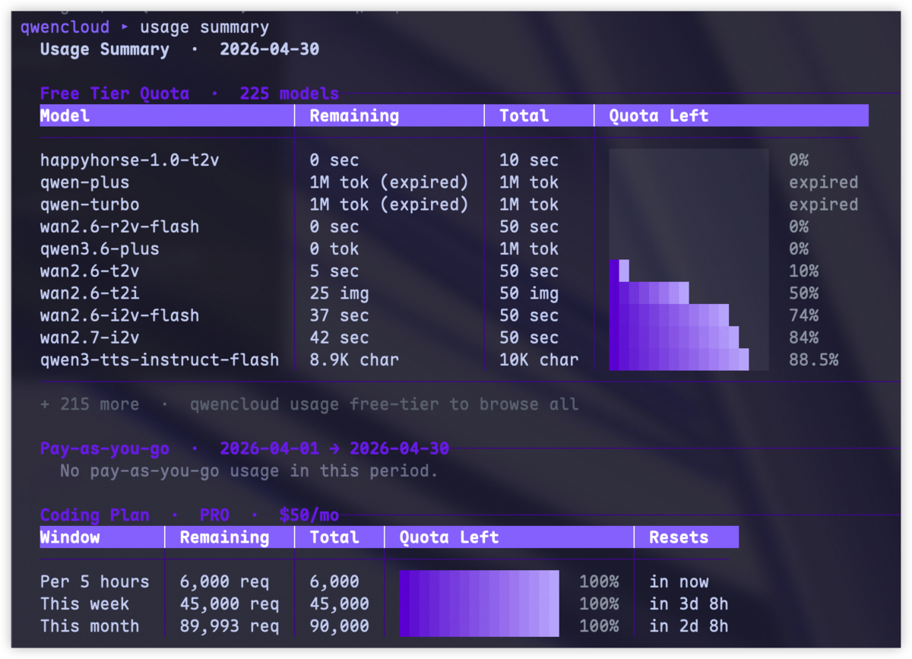
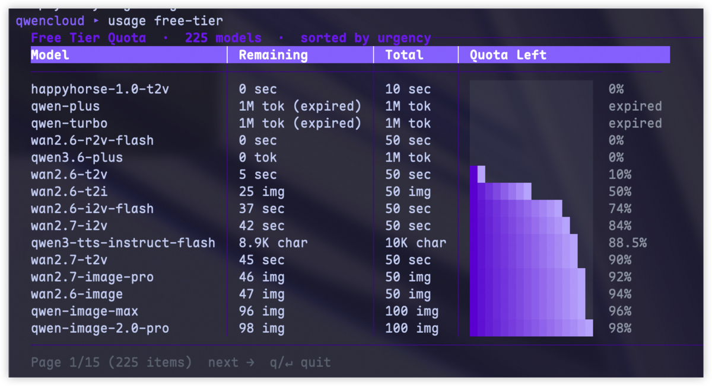
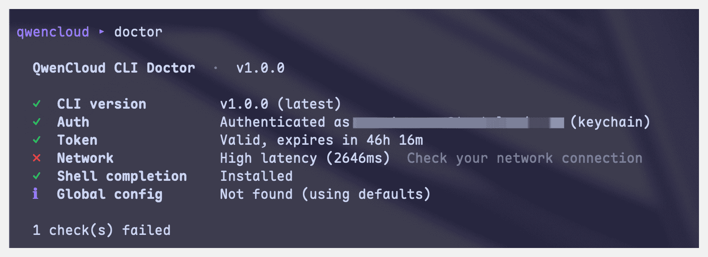

# QwenCloud CLI

<p>
  
</p>

> Official command-line tool for [QwenCloud](https://www.qwencloud.com/). Discover models, check usage, manage authentication, and diagnose local setup from a terminal or an AI agent runtime.


**English** · [中文](./README_zh-CN.md)

QwenCloud is an AI-native cloud for models, tools, and apps. It provides hosted models for text, vision, speech, image generation, video generation, structured output, and agentic applications. Learn more at [qwencloud.com](https://www.qwencloud.com/) and [docs.qwencloud.com](https://docs.qwencloud.com/).



---

## Features

- **Interactive and one-shot modes**: run `qwencloud` with no arguments for a REPL, or pass a command for scripts, CI, and agent tools.
- **Agent-ready contract**: commands support `--format json`, standardized exit codes, parseable JSON errors, and `--quiet` for exit-code-only checks.
- **Model and usage workflows**: browse models, inspect model metadata, search by keyword, and review Free Tier, Coding Plan, and PAYG usage.
- **Native credential storage**: credentials are stored in the OS keychain when available, with an encrypted file fallback. No `keytar` or native Node binding is required.
- **Self-documenting command tree**: every command supports `--help`; generated help is the canonical syntax reference.

---

## Installation

Choose the channel that matches your environment. npm and source builds are available.


### npm

```bash
npm install -g @qwencloud/qwencloud-cli
```

### Build from Source

```bash
git clone https://github.com/QwenCloud/qwencloud-cli.git
cd qwencloud-cli
pnpm install
pnpm run build
pnpm link --global
```

Verify the install:

```bash
qwencloud version
```

---

## Quick Start

### For Developers

```bash
# 1. Log in with OAuth Device Flow
qwencloud auth login

# 2. List available models
qwencloud models list

# 3. Inspect a model
qwencloud models info qwen3-coder-plus

# 4. Review current usage
qwencloud usage summary

# 5. Check auth, network, config, and local environment
qwencloud doctor
```

Running `qwencloud` with no arguments opens the REPL. The REPL uses the same command tree as one-shot mode and adds readline history, tab completion, and rich terminal tables.

### For AI Agents

Use one-shot commands and request JSON explicitly:

```bash
qwencloud auth status --format json
qwencloud models list --all --format json
qwencloud usage summary --period month --format json
qwencloud doctor --format json
```

Recommended agent startup flow:

```bash
# 1. Check whether credentials are usable
qwencloud auth status --format json

# 2. If auth is missing or expired, initialize non-interactive login
qwencloud auth login --init-only --format json

# 3. Ask the user to open the returned verification URL, then complete polling
qwencloud auth login --complete --format json
```

For richer agent integrations, see [QwenCloud/qwencloud-ai](https://github.com/QwenCloud/qwencloud-ai).

---

## Examples

Browse available models and inspect their modality, free tier quota, and pricing from the terminal:



Review account usage across Free Tier, Coding Plan, and PAYG in one command:



Drill into free tier quota status when you need to choose a model with remaining trial capacity:



Run diagnostics to verify authentication, network access, configuration, and shell completion:



---

## Commands

| Area | Commands | Common flags |
|---|---|---|
| Auth | `auth login`, `auth logout`, `auth status` | `--init-only`, `--complete`, `--timeout`, `--format` |
| Models | `models list`, `models info`, `models search` | `--input`, `--output`, `--all`, `--verbose`, `--page`, `--per-page`, `--format` |
| Usage | `usage summary`, `usage breakdown`, `usage free-tier`, `usage payg` | `--period`, `--from`, `--to`, `--days`, `--model`, `--granularity`, `--format` |
| Config | `config list`, `config get`, `config set`, `config unset` | `--format` |
| Diagnostics | `doctor` | `--format` |
| Shell | `completion install`, `completion generate` | `--shell` |
| Version | `version` | `--check` |

Use help for exact syntax:

```bash
qwencloud --help
qwencloud models --help
qwencloud usage breakdown --help
```

---

## Output and Exit Codes

Output format resolution order:

1. `--format` flag
2. `output.format` from config
3. TTY detection: table in an interactive terminal, JSON when piped or captured

```bash
qwencloud models list
qwencloud models list --format json
qwencloud models list --format text
qwencloud --quiet doctor
```

Exit codes:

| Code | Meaning |
|---:|---|
| `0` | Success |
| `1` | General or usage error |
| `2` | Authentication error |
| `3` | Network error |
| `4` | Configuration error |
| `130` | Interrupted |

JSON errors follow a stable shape:

```json
{
  "error": {
    "code": "AUTH_REQUIRED",
    "message": "Not authenticated. Run `qwencloud auth login` first.",
    "exit_code": 2
  }
}
```

For automation, prefer `--format json` and treat table output as human-only.

Example JSON output:

```json
{
  "models": [
    {
      "id": "qwen3-coder-plus",
      "modality": { "input": ["text"], "output": ["text"] },
      "pricing": { "tiers": [{ "input": 0.5, "output": 2.0, "unit": "USD/1M tokens" }] }
    }
  ],
  "pagination": { "page": 1, "per_page": 20, "total": 1 }
}
```

---

## Authentication

`qwencloud auth login` uses OAuth 2.0 Device Authorization Grant with PKCE.

Interactive login:

```bash
qwencloud auth login
```

Non-interactive login:

```bash
qwencloud auth login --init-only --format json
qwencloud auth login --complete --format json
```

Credentials are stored in the OS keychain when available. If keychain access is unavailable, the CLI falls back to an encrypted local credential file. Set `QWENCLOUD_KEYRING=plaintext` to force plaintext file storage for debugging; `no`, `0`, `false`, and `off` also skip keychain access.

---

## Configuration

QwenCloud CLI uses one global config file:

```text
~/.qwencloud/config.json
```

Public configuration keys:

| Key | Values | Default |
|---|---|---|
| `output.format` | `auto`, `table`, `json`, `text` | `auto` |

```bash
qwencloud config set output.format json
qwencloud config get output.format
qwencloud config list
qwencloud config unset output.format
```

---

## Contributing

We welcome fixes, documentation improvements, and feature proposals.

1. Start from the latest `master`.
2. Create a focused branch, for example `fix/auth-token-expiry` or `doc/install-options`.
3. Install dependencies with `pnpm install`.
4. Make the change and add or update tests when behavior changes.
5. Run the relevant checks before opening a PR:

```bash
pnpm run lint
pnpm run format:check
pnpm test
pnpm run build
```

6. Commit with [Conventional Commits](https://www.conventionalcommits.org/), such as `feat:`, `fix:`, `doc:`, `refactor:`, and `chore:`.
7. Push your branch and open a pull request against `master`.
8. Fill in the PR template, link related issues, describe user-visible changes, and include screenshots or terminal output for CLI UX changes.

Product-facing changes should include documentation updates and need product and engineering review.

---

## License

This project is licensed under the [Apache-2.0 License](LICENSE).
